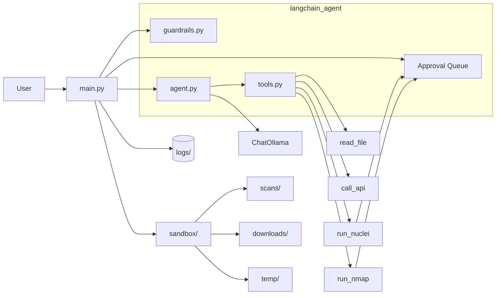

# e-agent

Local CLI AI agent powered by Ollama with LangChain for tool-calling orchestration.

## Overview

This project uses LangChain's ReAct agent pattern with Ollama for natural language understanding and tool execution. Tools are defined as Python functions with `@tool` decorators.

## Architecture At A Glance



## Repository Layout

```text
.
├── main.py                 # CLI entry point
├── config.yaml             # Configuration file
├── requirements.txt       # Python dependencies
├── README.md
├── AGENTS.md
├── sandbox/               # Sandbox workspace (created on startup)
│   ├── scans/
│   ├── downloads/
│   └── temp/
├── langchain_agent/
│   ├── __init__.py
│   ├── agent.py           # LangChain ReAct agent setup
│   ├── config.py          # Configuration loader
│   ├── tools.py           # @tool decorated functions
│   ├── guardrails.py      # Input/target validation
│   └── approval_queue.py  # Approval system
└── docs/
    ├── ARCHITECTURE.md
    └── RUNBOOK.md
```

## Runtime Flow

1. `main.py` starts CLI loop, logs to `logs/`
2. Input validated by `guardrails.validate_input()`
3. For approval-required tools, command is queued and user must approve
4. User message sent to LangChain `AgentExecutor`
5. Model decides: respond directly or call tool
6. If tool call: LangChain executes `@tool` function
7. Tool result returned to model for final response
8. Response displayed to user

## Setup

### 1. Create and activate virtual environment

```bash
uv venv .venv
source .venv/bin/activate
```

### 2. Install dependencies

```bash
uv pip install -r requirements.txt
```

### 3. Start Ollama

```bash
ollama serve
ollama pull llama3.1
```

### 4. Install Nuclei (optional, for vulnerability scanning)

```bash
# Download from https://github.com/projectdiscovery/nuclei
# Or use: go install - github.com/projectdiscovery/nuclei/v3/cmd/nuclei@latest
```

### 5. Start the agent CLI

```bash
python main.py
```

Type `exit` to quit.

## Configuration

Configuration is managed via `config.yaml`:

```yaml
model:
  name: "llama3.1"
  ollama_host: "http://127.0.0.1:11434"

agent:
  name: "electron-agent"
  log_file: "logs/agent.log"

sandbox:
  path: "./sandbox"
  directories:
    - scans
    - downloads
    - temp

tools:
  auto:
    - read_file
    - call_api
  approval_required:
    - run_nmap
    - run_nuclei

approval:
  timeout_minutes: 5
  allow_approve_all: true
```

## Available Tools

| Tool | Category | Description |
|------|----------|-------------|
| `read_file` | Auto | Read file contents from disk (sandboxed) |
| `call_api` | Auto | Make HTTP GET request to a URL |
| `run_nmap` | Approval | Run network scan (ports/services) |
| `run_nuclei` | Approval | Run vulnerability scan |

## Approval System

For tools marked as `approval_required`, you must approve before execution:

### Commands

| Command | Description |
|---------|-------------|
| `/approve <id>` | Approve a pending request |
| `/deny <id>` | Deny a pending request |
| `/approve-all <tool>` | Auto-approve all requests for a tool in this session |

### Example Usage

```
[+] you -> scan example.com for vulnerabilities
[*] e-agent -> [Using tool: run_nuclei]
Use /approve abc12345 to execute this command.

[+] you -> /approve abc12345
Executing run_nuclei...
Nuclei scan started (PID: 12345). Check results in a few minutes at: sandbox/scans/...
```

### Approve All

For convenience during bug bounty hunting, you can auto-approve all requests for a tool:

```
[+] you -> /approve-all nuclei
All nuclei commands will now execute without approval for this session.
```

### Background Execution

Nuclei scans run in the background. After approval:
- The scan starts immediately in background
- Results are saved to `sandbox/scans/`
- Use `read_file` to view results after scan completes

```
[+] you -> read /path/to/sandbox/scans/nuclei-...
```

## Sandbox

All file operations are sandboxed to prevent access to sensitive files:

- `read_file` - Only reads files within sandbox directory
- `call_api` - Saves downloads to `sandbox/downloads/`
- `run_nmap`, `run_nuclei` - Save scan output to `sandbox/scans/`

## Guardrails

### Input validation
- Rejects input > 5000 characters
- Blocks prompt injection phrases

### Tool restrictions
- `run_nmap`, `run_nuclei` block targets: `localhost`, `127.0.0.1`, `169.254.169.254`
- `run_nmap` only allows flags: `-sV`, `-sS`, `-Pn`, `-F`, `-O`
- `read_file` restricted to sandbox directory

## Logging

Logs are stored in `logs/` with 7-day rotation:
- `agent.log.2026-04-12`
- `agent.log.2026-04-13`
- etc.

Each log entry includes timestamp, level, and message.

## Additional Docs

- Architecture: [`docs/ARCHITECTURE.md`](docs/ARCHITECTURE.md)
- Operations: [`docs/RUNBOOK.md`](docs/RUNBOOK.md)
