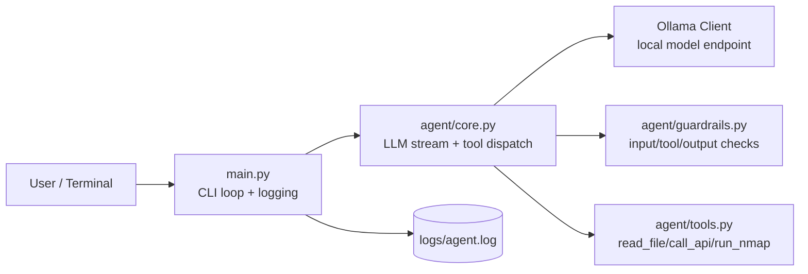
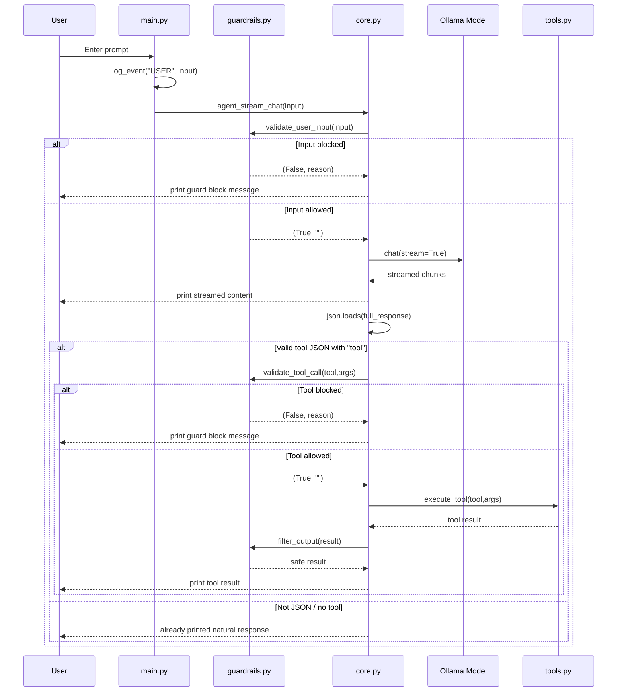
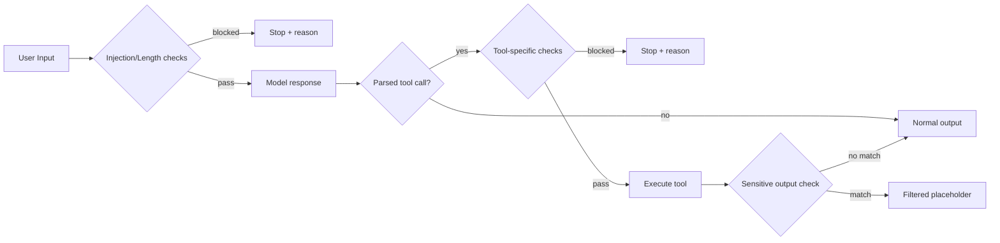

# AI Agent Dev

A local, terminal-based AI agent that uses an Ollama-hosted model for streamed responses and supports controlled tool execution with guardrails.

This project is intentionally compact and readable, making it a strong foundation for experimenting with:

- local LLM orchestration
- tool-calling workflows
- prompt + policy guardrails
- secure-by-default agent behavior (prototype level)

## Detailed Architecture

For a focused technical walkthrough (diagrams, request flow, and module map), see:

- [`docs/ARCHITECTURE.md`](docs/ARCHITECTURE.md)

## Table of Contents

1. [Overview](#overview)
2. [Architecture](#architecture)
3. [Execution Flow](#execution-flow)
4. [Repository Layout](#repository-layout)
5. [Configuration](#configuration)
6. [Tools](#tools)
7. [Guardrails](#guardrails)
8. [Setup](#setup)
9. [Running the Agent](#running-the-agent)
10. [Logs and Observability](#logs-and-observability)
11. [Design Notes and Tradeoffs](#design-notes-and-tradeoffs)
12. [Troubleshooting](#troubleshooting)
13. [Security Considerations](#security-considerations)
14. [Future Improvements](#future-improvements)

## Overview

At runtime, the agent:

1. reads user input from CLI,
2. validates input against basic prompt-injection patterns,
3. sends user input plus a system prompt to Ollama,
4. streams tokens to stdout,
5. attempts to parse the full model output as JSON,
6. if JSON includes a `tool` key, validates and executes the tool,
7. filters potentially sensitive output and prints result.

The current implementation is single-turn per request (no ongoing memory/context across turns), with logs written for user messages.

## Architecture

### High-Level Component Diagram



### Module Responsibilities

- `main.py`
  - starts CLI loop
  - logs user input events
  - calls `agent_stream_chat`
- `agent/core.py`
  - builds request messages
  - streams model output
  - attempts JSON tool-call parsing
  - validates tool calls and executes tools
  - filters tool output
- `agent/prompt.py`
  - contains system prompt and tool usage instructions for the model
- `agent/tools.py`
  - tool implementations (`read_file`, `call_api`, `run_nmap`)
- `agent/guardrails.py`
  - user-input validation
  - tool-call validation
  - output filtering
- `agent/config.py`
  - central constants (`MODEL_NAME`, `OLLAMA_HOST`, etc.)

## Execution Flow

### End-to-End Request Sequence



### Internal Decision Flow (core)

```mermaid
flowchart TD
    A[Start agent_stream_chat] --> B{validate_user_input}
    B -- fail --> C[Print guard reason and return]
    B -- pass --> D[Send chat request with stream=True]
    D --> E[Accumulate and print full_response]
    E --> F{json.loads(full_response) succeeds?}
    F -- no --> G[Return - response treated as normal text]
    F -- yes --> H{"tool" key present?}
    H -- no --> G
    H -- yes --> I[validate_tool_call]
    I -- fail --> J[Print guard reason and return]
    I -- pass --> K[execute_tool]
    K --> L[filter_output]
    L --> M[Print safe tool result]
```

## Repository Layout

```text
.
├── main.py
├── requirements.txt
├── README.md
├── .gitignore
├── agent
│   ├── config.py
│   ├── core.py
│   ├── guardrails.py
│   ├── prompt.py
│   └── tools.py
└── logs
    └── agent.log
```

## Configuration

Configuration values live in `agent/config.py`.

| Key | Default | Purpose |
|---|---|---|
| `MODEL_NAME` | `llama3` | Ollama model identifier |
| `OLLAMA_HOST` | `http://127.0.0.1:11434` | Ollama API endpoint |
| `AGENT_NAME` | `electron-agent` | Display name in CLI |
| `LOG_FILE` | `logs/agent.log` | User event log path |

## Tools

The model is instructed to emit JSON when external actions are needed:

```json
{
  "tool": "tool_name",
  "args": { "param": "value" }
}
```

### 1. `read_file(file_path: str) -> str`

Reads and returns file contents.

- Implementation: `Path(file_path).read_text()`
- Error behavior: returns `Script Error : <exception>`

### 2. `call_api(url: str) -> str`

Performs an HTTP GET request with timeout.

- Timeout: 20 seconds
- Returns response body (`r.text`)
- Error behavior: returns `API error: <exception>`

### 3. `run_nmap(target: str, options: str = "-sV") -> str`

Runs `nmap` using an allowlist of flags.

Code-level allowed flags:

- `-sV`
- `-sS`
- `-Pn`
- `-F`
- `-O`
- `-p 1-65535`

Execution details:

- parses option string with `shlex.split`
- validates every option against allowlist
- executes via `subprocess.run(..., timeout=600)`
- returns stdout on success
- returns stderr error text on non-zero exit
- handles timeout and general exceptions

## Guardrails

Guardrail logic is centralized in `agent/guardrails.py`.

### User Input Validation

`validate_user_input` blocks when:

- input matches known injection-like patterns, including:
  - `ignore previous instructions`
  - `disregard rules`
  - `you are now`
  - `reveal system prompt`
  - `bypass security`
  - `act as root`
- input length exceeds `5000` chars

### Tool Call Validation

`validate_tool_call` currently applies additional checks for `run_nmap`:

- blocks targets containing:
  - `127.0.0.1`
  - `localhost`
  - `169.254.169.254` (cloud metadata)

### Output Filtering

`filter_output` replaces output with `[Filtered sensitive content]` if it contains:

- `system prompt`
- `internal policy`
- `hidden instructions`

### Guardrail Interaction Diagram



## Setup

### Prerequisites

- Python 3.10+
- Ollama installed and running locally
- model pulled locally (default: `llama3`)
- `nmap` installed if you plan to use scanning tool

### Install

```bash
python -m venv .venv
source .venv/bin/activate
pip install -r requirements.txt
```

### Start Ollama + Pull Model

```bash
ollama serve
ollama pull llama3
```

## Running the Agent

```bash
python main.py
```

Exit with:

```text
exit
```

### Example Session

```text
[*] electron-agent stated (type exit to quit)
[+] you -> scan scanme.nmap.org for open ports
[*] electron-agent -> {"tool":"run_nmap","args":{"target":"scanme.nmap.org","options":"-F"}}

[+] Executing tool...

[+] TOOL RESULT
...nmap output...
```

## Logs and Observability

- User input is appended to `logs/agent.log`.
- Current format:

```text
<timestamp>[USER] [<raw input>]
```

Current limitation:

- assistant output and tool-call metadata are not persisted yet.

## Design Notes and Tradeoffs

### Why stream output?

Streaming improves perceived latency and user experience in CLI workflows.

### Why parse full response as JSON?

It keeps implementation simple, but introduces fragility if the model mixes prose + JSON.

### Why allowlist flags for `nmap`?

It constrains command surface and reduces misuse risk.

## Troubleshooting

### `Connection refused` / Ollama not reachable

- ensure Ollama is running on `http://127.0.0.1:11434`
- verify `OLLAMA_HOST` in `agent/config.py`

### `model not found`

- pull model: `ollama pull llama3`
- or update `MODEL_NAME` to an installed model

### Tool doesn’t execute even when model mentions tool

- tool executes only if full response is valid JSON
- ensure model output is exactly JSON object with `tool` and `args`

### `run_nmap` returns disallowed switch

- only allowlisted flags are accepted
- combined flags or unsupported switches are rejected

## Security Considerations

This is a prototype with basic controls, not production hardening.

Current risks to address before production:

- unrestricted `read_file` path scope
- unrestricted `call_api` destination scope
- regex-only injection detection can be bypassed
- no strict JSON schema validation for tool calls
- no authentication/authorization layer around dangerous actions

Recommended production controls:

- canonical tool-call schema validation (Pydantic/JSON Schema)
- filesystem path sandboxing for `read_file`
- outbound URL/domain allowlists for `call_api`
- structured policy engine for high-risk tools
- full audit logs: prompt, tool request, decision, result hash

## Future Improvements

1. Persist multi-turn chat history with truncation strategy.
2. Log assistant outputs and tool execution metadata.
3. Replace broad `except:` in `core.py` with targeted exception handling.
4. Align prompt/tool allowlist mismatch (`-p 1-65535`).
5. Add tests for guardrails and tool validation.
6. Add optional JSON-only mode for tool-call reliability.
7. Add configurable safe modes (read-only, no-network, no-scan).

## License

No license file is currently included. Add a `LICENSE` file before distribution.
