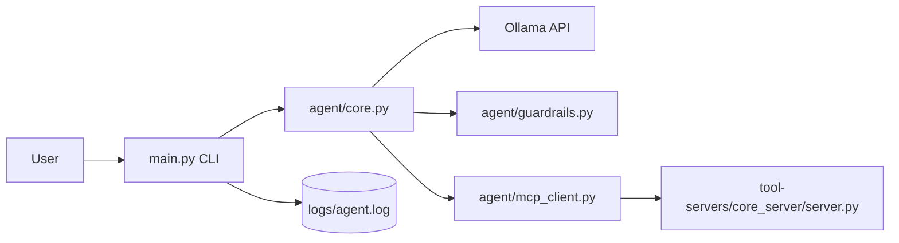

# AI Agent Dev

Local CLI AI agent powered by Ollama, with external tool execution delegated to a FastAPI-based MCP-style tool server.

## What Changed

The project moved from in-process tools (`agent/tools.py`) to a client/server tool boundary:

- Agent side: `agent/mcp_client.py` calls tools over HTTP.
- Server side: `tool-servers/core_server/server.py` exposes tool endpoints.

This separates model orchestration from tool execution and makes it easier to scale or isolate tool runtimes.

## Architecture At a Glance



Detailed diagrams: [`docs/ARCHITECTURE.md`](docs/ARCHITECTURE.md)

## Repository Layout

```text
.
├── main.py
├── README.md
├── requirements.txt
├── agent
│   ├── config.py
│   ├── core.py
│   ├── guardrails.py
│   ├── mcp_client.py
│   └── prompt.py
├── tool-servers
│   └── core_server
│       └── server.py
├── docs
│   ├── ARCHITECTURE.md
│   └── RUNBOOK.md
└── logs
    └── agent.log
```

## Runtime Flow

1. User enters input in CLI (`main.py`).
2. Input is validated by `validate_user_input`.
3. Agent sends a system + user message to Ollama with streaming enabled.
4. Agent prints streamed model output.
5. Agent tries to parse full output as JSON tool call.
6. If tool JSON exists, agent validates tool call and forwards it via `mcp_client.call_tool`.
7. Tool server executes request and returns JSON (`output` or `error`).
8. Agent filters tool output and prints safe result.

## Components

### Agent (`main.py`, `agent/*`)

- `main.py`: CLI loop + user input logging.
- `agent/core.py`: model streaming + tool-call parsing + tool dispatch.
- `agent/mcp_client.py`: HTTP POST wrapper to MCP server (`http://127.0.0.1:8001`).
- `agent/guardrails.py`: prompt-injection checks, blocked scan targets, output filtering.
- `agent/prompt.py`: model behavior + tool-call JSON contract.
- `agent/config.py`: model host/name and display config.

### Tool Server (`tool-servers/core_server/server.py`)

FastAPI app exposing:

- `GET /tools`: list available tools.
- `POST /tools/read_file`: read file contents.
- `POST /tools/call_api`: HTTP GET proxy.

Code also contains `run_nmap` logic, but route registration currently needs attention (see Known Issues).

## Setup

## 1) Create and activate environment

```bash
python -m venv .venv
source .venv/bin/activate
```

## 2) Install dependencies

```bash
pip install -r requirements.txt
```

## 3) Start Ollama

```bash
ollama serve
ollama pull llama3
```

## 4) Start tool server

```bash
uvicorn server:app --app-dir tool-servers/core_server --host 127.0.0.1 --port 8001 --reload
```

## 5) Start agent CLI

```bash
python main.py
```

Type `exit` to quit.

## Configuration

From `agent/config.py`:

- `MODEL_NAME` (default: `llama3`)
- `OLLAMA_HOST` (default: `http://127.0.0.1:11434`)
- `AGENT_NAME` (default: `electron-agent`)
- `LOG_FILE` (default: `logs/agent.log`)

From `agent/mcp_client.py`:

- `MCP_SERVER` (default: `http://127.0.0.1:8001`)

## Tool Call Contract

Model is expected to return JSON when a tool is needed:

```json
{
  "tool": "read_file",
  "args": {
    "file_path": "/abs/path/file.txt"
  }
}
```

Agent forwards request to:

- `POST /tools/<tool_name>` with body `args`.

Server returns one of:

```json
{"output": "..."}
```

```json
{"error": "..."}
```

## Guardrails

- Blocks known prompt injection phrases.
- Rejects oversized inputs (`> 5000` chars).
- Blocks `run_nmap` targets containing:
  - `127.0.0.1`
  - `localhost`
  - `169.254.169.254`
- Filters response text containing sensitive phrases.

## Logs

User messages are appended to `logs/agent.log` in `main.py`.

Current logging scope:

- user inputs are logged
- assistant outputs and tool execution metadata are not logged yet

## Known Issues (Current Code)

1. In `tool-servers/core_server/server.py`, `run_nmap` exists as a function but is not currently decorated with `@app.post("/tools/run_nmap")`.
2. In the same function, invalid option branch returns `Disallowed switch {e}` where `e` is undefined.
3. In `agent/core.py`, `except:` around JSON parsing is broad; malformed responses are silently ignored.

## Next Recommended Improvements

1. Register `/tools/run_nmap` route explicitly.
2. Fix undefined variable in invalid-flag error path.
3. Add strict schema validation for model tool JSON.
4. Add retry/error handling in `mcp_client.call_tool` for network failures.
5. Persist conversation history and tool traces.

## Additional Docs

- Architecture diagrams: [`docs/ARCHITECTURE.md`](docs/ARCHITECTURE.md)
- Operations + troubleshooting: [`docs/RUNBOOK.md`](docs/RUNBOOK.md)
