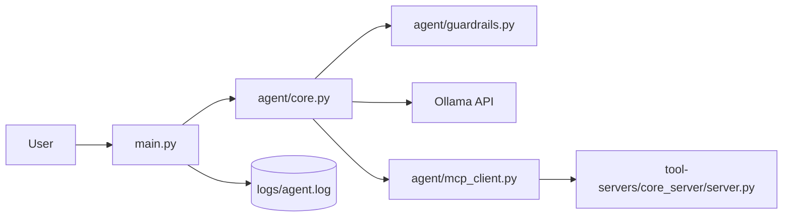

# AI Agent Dev

Local CLI AI agent powered by Ollama, with tool execution delegated to a FastAPI-based MCP-style server.

## Overview

This project is split into two runtimes:

- The CLI agent handles prompting, guardrails, tool-call detection, and output display.
- The tool server exposes a small HTTP tool surface for file reads, HTTP fetches, and `nmap` scans.

The current codebase builds the system prompt dynamically by discovering tools from the running tool server and converting them into a YAML tool section. The prompt is initialized lazily and can refresh tool metadata if discovery was unavailable earlier in the session.

## Architecture At A Glance



More detail: [`docs/ARCHITECTURE.md`](docs/ARCHITECTURE.md)

## Repository Layout

```text
.
├── main.py
├── requirements.txt
├── README.md
├── agent/
│   ├── base_prompt.py
│   ├── config.py
│   ├── core.py
│   ├── guardrails.py
│   ├── mcp_client.py
│   ├── prompt.py
│   └── prompt_builder.py
├── docs/
│   ├── ARCHITECTURE.md
│   └── RUNBOOK.md
└── tool-servers/
    └── core_server/
        └── server.py
```

## Current Runtime Flow

1. `main.py` starts the CLI loop and logs user input to `logs/agent.log`.
2. `agent/core.py` validates the input with `validate_user_input`.
3. When handling a request, `agent/core.py` obtains the active system prompt from:
   - `agent/base_prompt.py`
   - `agent/prompt_builder.py`
   - the `/tools` response from the tool server
4. If no prompt has been built yet, or if the cached tool list is empty, the agent refreshes tool discovery and rebuilds the prompt.
5. The agent sends the system prompt plus user message to Ollama using streaming.
6. The full model response is buffered, then scanned for a valid JSON object containing a `tool` key.
7. If the JSON contains a `tool` key, the agent validates the tool call and sends it to the tool server.
8. `call_tool()` tries each configured MCP server until it receives a valid success payload.
9. The tool server returns either `{ "output": ... }` or `{ "error": ... }`.
10. The agent filters tool output for sensitive phrases and prints the result.
11. If no valid tool JSON is found, the buffered model response is printed as normal chat output.

## Components

### CLI and Agent

- `main.py`: CLI loop, prompt display, user input logging
- `agent/core.py`: prompt assembly, prompt refresh, Ollama chat, tool-call parsing, tool dispatch
- `agent/base_prompt.py`: base system instructions for normal replies vs tool calls
- `agent/prompt_builder.py`: converts discovered tools into YAML for the prompt
- `agent/mcp_client.py`: tool discovery and tool execution over HTTP
- `agent/guardrails.py`: input validation, `run_nmap` target restrictions, output filtering
- `agent/config.py`: model host/name, agent name, log file path

### Tool Server

`tool-servers/core_server/server.py` exposes:

- `GET /tools`
- `POST /tools/read_file`
- `POST /tools/call_api`
- `POST /tools/run_nmap`

## Tool Discovery

The agent no longer relies on a hardcoded tool list at runtime. Instead:

- `discover_tools()` fetches `/tools` from each configured MCP server
- discovered tools are cached in `TOOLS_CACHE`
- `build_tools_section()` renders the discovered tools into YAML
- the YAML is appended to `BASE_SYSTEM_PROMPT`
- `get_system_prompt()` rebuilds the prompt if it has not been initialized yet or if cached discovery is empty

Important consequence: starting the tool server before `python main.py` is still the best path, but the agent can now recover by refreshing tool discovery when a request is handled.

## Setup

### 1. Create and activate a virtual environment

```bash
python -m venv .venv
source .venv/bin/activate
```

### 2. Install dependencies

```bash
pip install -r requirements.txt
```

### 3. Start Ollama

```bash
ollama serve
ollama pull llama3
```

### 4. Start the tool server

```bash
uvicorn server:app --app-dir tool-servers/core_server --host 127.0.0.1 --port 8001 --reload
```

### 5. Start the agent CLI

```bash
python main.py
```

Type `exit` to quit.

## Configuration

From `agent/config.py`:

- `MODEL_NAME = "llama3"`
- `OLLAMA_HOST = "http://127.0.0.1:11434"`
- `AGENT_NAME = "electron-agent"`
- `LOG_FILE = "logs/agent.log"`

From `agent/mcp_client.py`:

- `MCP_SERVERS = ["http://127.0.0.1:8001"]`
- `MCP_SERVER = MCP_SERVERS[0]`

## Tool Contract

Expected model tool call:

```json
{
  "tool": "read_file",
  "args": {
    "file_path": "/abs/path/file.txt"
  }
}
```

Agent-to-server contract:

- request: `POST /tools/<tool_name>`
- request body: the `args` object
- response: `{ "output": ... }` or `{ "error": ... }`

If multiple MCP servers are configured, tool execution now skips servers that return transport errors, HTTP errors, empty responses, invalid JSON, or JSON error payloads, and continues trying the next server.

## Guardrails

### Input guardrails

- blocks prompt-injection phrases such as `ignore previous instructions`
- rejects input longer than 5000 characters

### Tool guardrails

- blocks `run_nmap` targets containing:
  - `127.0.0.1`
  - `localhost`
  - `169.254.169.254`

### Output filtering

- filters responses containing:
  - `system prompt`
  - `internal policy`
  - `hidden instructions`

## Operational Notes

- `call_tool()` iterates through every configured MCP server until one succeeds.
- `discover_tools()` caches results for the lifetime of the process.
- `discover_tools(force_refresh=True)` can refresh the cache when prompt rebuilds are needed.
- The agent buffers the entire Ollama response before printing anything, even though chat is requested with `stream=True`.
- `extract_tool_call()` now uses JSON decoding from each `{` position instead of a greedy regex search.
- the CLI and Ollama call paths now fail gracefully instead of terminating the session on uncaught exceptions.

## Current Limitations

1. Tool discovery is cached, so newly added tools on a healthy running server are not picked up until a refresh path runs or the agent restarts.
2. The Ollama response is still fully buffered before display, even though upstream streaming is enabled.
3. Only user inputs are logged today; assistant responses and tool traces are not persisted.
4. `call_api` is a simple HTTP GET proxy and has no auth, header control, or response-size limits.
5. `agent/prompt.py` still exists in the repo as an older prompt definition, but the active runtime path uses `BASE_SYSTEM_PROMPT` plus the dynamically built tools section.

## Additional Docs

- Architecture: [`docs/ARCHITECTURE.md`](docs/ARCHITECTURE.md)
- Operations and troubleshooting: [`docs/RUNBOOK.md`](docs/RUNBOOK.md)
