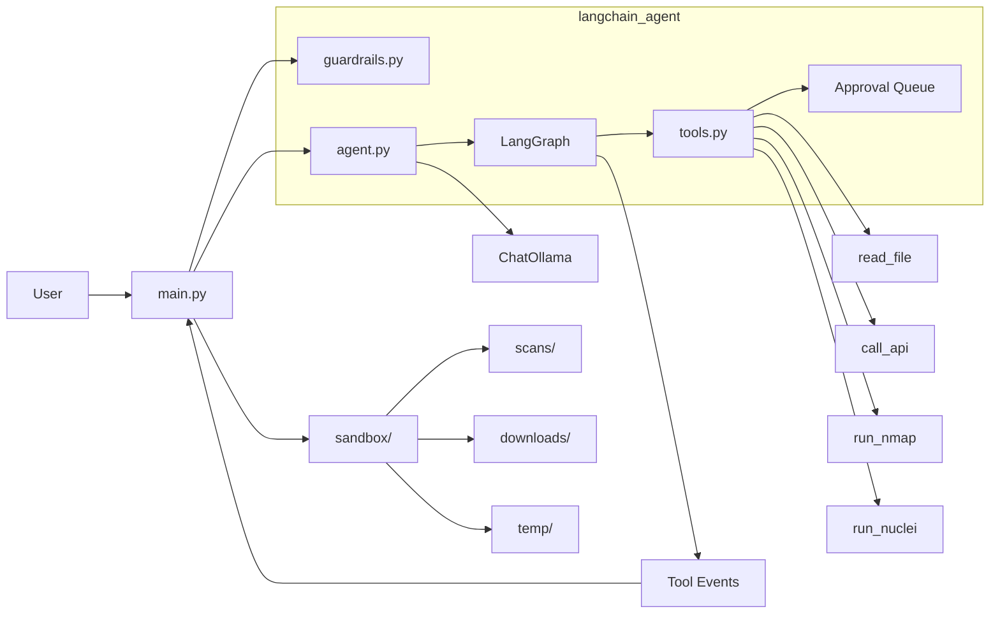

# e-agent

Local CLI AI agent powered by Ollama with LangGraph for multi-tool chaining.

## Overview

e-agent uses LangGraph's StateGraph for tool chaining orchestration. It can execute multiple tools sequentially, pass outputs between tools, and stream tool lifecycle events in real-time.

## Architecture At A Glance



## Key Features

| Feature | Description |
|---------|-------------|
| Multi-tool chains | Execute 2+ tools sequentially |
| Live streaming | See tool output as it runs |
| Chain termination | Errors or approval needs stop the chain |
| Approval integration | Pauses mid-chain for approval |
| Context passing | Tool outputs feed into next tool |

## Repository Layout

```
.
├── main.py                 # CLI entry point
├── config.yaml           # Configuration file
├── requirements.txt      # Python dependencies
├── README.md
├── AGENTS.md
├── sandbox/             # Sandbox workspace
│   ├── scans/
│   ├── downloads/
│   └── temp/
├── langchain_agent/
│   ├── __init__.py
│   ├── agent.py         # LangGraph agent setup
│   ├── config.py       # Configuration loader
│   ├── tools.py       # @tool decorated functions + ToolEvent
│   ├── guardrails.py  # Input/target/URL validation
│   ├── approval_queue.py  # Approval system + chain state
│   └── rate_limiter.py  # Rate limiting
└── docs/
    ├── ARCHITECTURE.md
    └── RUNBOOK.md
```

## Setup

### 1. Create and activate virtual environment

```bash
uv venv .venv
source .venv/bin/activate
```

### 2. Install dependencies

```bash
uv pip install -r requirements.txt
```

### 3. Start Ollama

```bash
ollama serve
ollama pull llama3.1
```

### 4. Install Nuclei (optional)

```bash
go install github.com/projectdiscovery/nuclei/v3/cmd/nuclei@latest
```

### 5. Start the agent CLI

```bash
python main.py
```

Type `exit` to quit.

## Tool Chaining

### Example: Multi-tool chain

```
[+] you -> scan example.com then check for vulnerabilities
[*] e-agent -> [*] Running run_nmap...
[Port scan results...]
[✓] run_nmap completed
[*] Running run_nuclei...
[vuln results...]
[✓] run_nuclei completed
```

### Live Tool Events

Tool lifecycle streams to the console:

```
[*] Running read_file...    # Tool started
[file contents...]
[✓] read_file completed  # Success

[*] Running run_nmap...   # Next tool started
[Port results...]
[✓] run_nmap completed

[*] Running run_nuclei...
[✗] run_nuclei failed: approval required  # Needs approval
```

### Approval in Tools

When a tool requires approval:

```
[+] you -> scan example.com
[*] Running run_nmap...
[✗] run_nmap failed: approval required
[approval_required] Use /approve abc123 to execute this command.
```

Approving executes only the requested tool (the chain does not resume):

```
[+] you -> /approve abc123
Executing run_nmap...
[✓] run_nmap completed
```

Note: After approval, only that single tool runs. If you had a multi-step
request, re-issue the original prompt to continue.

### Error Handling

On tool error, the chain terminates:

```
[+] you -> scan example.com
[*] Running run_nmap...
[✗] run_nmap failed: Disallowed switch -T4
[error] Disallowed switch -T4
```

The chain stops. Re-issue the command with corrected parameters.

### Chain Limits

Max 5 tools per chain to prevent runaway. When the limit is reached,
the chain ends and any remaining tools are not executed. Re-issue the
command to continue from where it stopped.

## Configuration

Configuration in `config.yaml`:

```yaml
model:
  name: "llama3.1"
  ollama_host: "http://127.0.0.1:11434"

agent:
  name: "electron-agent"
  log_file: "logs/agent.log"

sandbox:
  path: "./sandbox"
  directories: [scans, downloads, temp]

tools:
  auto: [read_file, call_api]
  approval_required: [run_nmap, run_nuclei]
```

## Available Tools

| Tool | Category | Description |
|------|----------|-------------|
| `read_file` | Auto | Read file contents from disk (sandboxed) |
| `call_api` | Auto | HTTP GET request |
| `run_nmap` | Approval | Network scan (ports/services) |
| `run_nuclei` | Approval | Vulnerability scan |

## Approval System

### Commands

| Command | Description |
|---------|-------------|
| `/approve <id>` | Approve a pending request |
| `/deny <id>` | Deny a pending request |
| `/approve-all <tool>` | Auto-approve all requests |

### Example

```
[+] you -> scan example.com
[*] e-agent -> [Using tool: run_nuclei]
Use /approve abc12345 to execute this command.

[+] you -> /approve abc12345
Executing run_nuclei...
[✓] run_nuclei completed
```

### Auto-approve

```
[+] you -> /approve-all run_nmap
All run_nmap commands will now execute without approval for this session.
```

## Sandbox

All file operations sandboxed:

- `read_file` - Only sandbox directory
- `call_api` - Saves to `sandbox/downloads/`
- `run_nmap`, `run_nuclei` - Save to `sandbox/scans/`

## Guardrails

- Input: max 5000 chars, prompt injection detection
- Targets: blocks localhost, 127.0.0.1, metadata IPs
- nmap: flag allowlist (`-sV`, `-sS`, `-Pn`, `-F`, `-O`)
- call_api: http/https only, no internal URLs
- Rate limiting: per-tool limits

## Documentation

- Architecture: [`docs/ARCHITECTURE.md`](docs/ARCHITECTURE.md)
- Operations: [`docs/RUNBOOK.md`](docs/RUNBOOK.md)