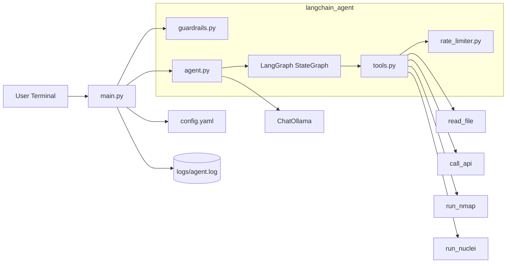
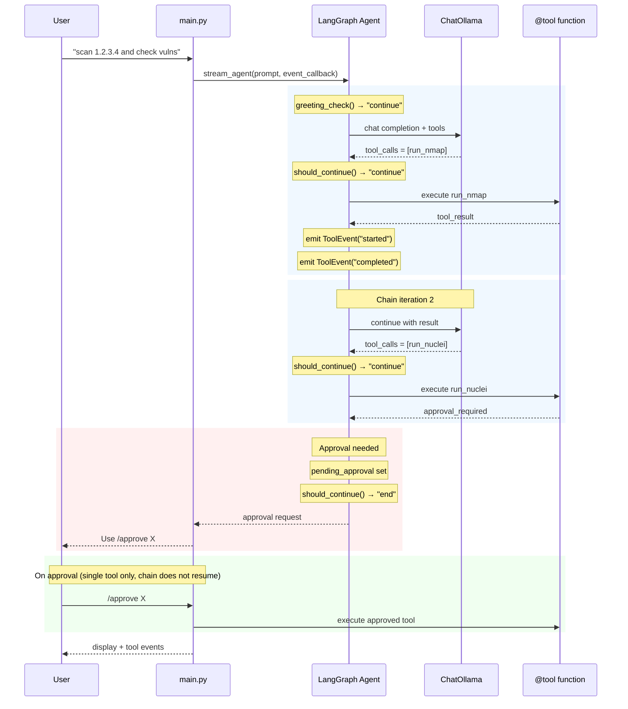

# Architecture

This project uses LangGraph for tool chaining orchestration with Ollama.

## High-Level Topology



## LangGraph Tool Chaining Architecture

```
┌─────────────────────────────────────────────────────────────┐
│                     main.py (CLI Loop)                       │
└─────────────────────┬───────────────────────────────────────┘
                    │
        ┌───────────┴───────────┐
        ▼                   ▼
   guardrails.py     stream_agent()
                          │
                          ▼
               ┌────────────────────┐
               │ LangGraph Agent    │
               ├────────────────────┤
               │ greeting_check()   │──→ decides: greeting or continue
               │ greeting_response()│──→ direct reply for greetings
               │ should_continue() │──→ decides: continue or END
               │ call_llm()         │──→ calls ChatOllama
               │ execute_tool_node()│──→ executes tools + emits events
               └────────────────────┘
                          │
               ┌────────────┴────────────┐
               ▼                         ▼
          Tool Events          Tool Results
          (callback)           (to LLM)
```

## Tool Chaining Flow

```
┌─────────────────────────────────────────────────────────────┐
│  User: "scan server and check for vulns"                    │
└─────────────────────────────────────────────────────────────┘
                          │
                          ▼
              ┌───────────────────────┐
              │  greeting_check()      │
              │  → "continue" (not a  │
              │    greeting)          │
              └───────────────────────┘
                          │
                          ▼
              ┌───────────────────────┐
              │  LLM decides: 2 tools  │
              │  1. run_nmap          │
              │  2. run_nuclei        │
              └───────────────────────┘
                          │
           ┌───────────────┼───────────────┐
           ▼               ▼               ▼
     Tool 1 runs       Error?          Approval?
     + events        ↓↓                   ↓↓
     output ──►   chain stops    chain pauses
     to LLM                       /approve X
     ↓↓                           (single tool
     Tool 2                        only)
     ...
```

## Agent State (TypedDict)

```python
class AgentState(TypedDict):
    messages: list[BaseMessage]      # conversation history
    tool_results: list[str]          # outputs from each tool
    chain_depth: int                 # tools executed so far
    pending_approval: dict | None    # approval state if paused
    retry_count: int                 # reserved (currently unused)
    last_error: str | None          # set on error → terminates chain
```

## Key Components

### ChatOllama
- Connects to local Ollama instance
- Handles chat completions with streaming support

### LangGraph StateGraph
- Tool calling with explicit state management
- Greeting detection bypasses tools for casual input
- Max chain length: 5 tools (enforced)
- Errors terminate the chain (no retry)

### ToolEvent System
```python
class ToolEvent:
    def __init__(self, tool_name: str, event_type: str, message: str = ""):
        self.tool_name = tool_name    # which tool
        self.event_type = event_type  # "started", "completed", "failed"
        self.message = message        # error message if failed (default: "")
        self.timestamp = datetime.now().isoformat()  # set automatically
```

### @tool Decorated Functions
- Auto-generate JSON schemas for prompts
- Return ToolOutput pydantic model

## Request Lifecycle with Tool Chaining



## Module Responsibilities

### main.py
- CLI loop with input/output
- Logging to `logs/agent.log`
- Delegates to LangGraph agent
- Event callback for tool lifecycle display

### langchain_agent/agent.py
- `ChatOllama` initialization
- `create_langgraph_agent()` factory
- `stream_agent(event_callback)` with events
- `invoke_agent()` for blocking calls
- Tool execution state management
- Greeting detection for casual input

### langchain_agent/tools.py
- `@tool` decorated functions
- `ToolEvent` class for lifecycle events
- `get_tool_function()` lookup

### langchain_agent/guardrails.py
- `validate_input()`: length + injection detection
- Target blocking (localhost, metadata IPs)

### langchain_agent/approval_queue.py
- Approval request management
- `chain_state` stored with request (for future chain resume)

### langchain_agent/rate_limiter.py
- Per-tool rate limiting

### langchain_agent/config.py
- Model/host configuration
- Guardrails from config.yaml

## Tool Output Format

All tools return standardized `ToolOutput`:

```python
class ToolOutput(BaseModel):
    status: str             # "success", "error", "blocked", "approval_required"
    tool: str               # tool name
    output: str             # result message
    saved_to: str | None    # file path if saved
```

Tools requiring approval return an `ApprovalRequired` model with a
`request_id` that the user must approve via `/approve <id>`.

## Security

- Input: max 5000 chars, prompt injection detection
- nmap/nuclei: target blocking via config
- nmap: flag allowlist
- call_api: URL scheme + internal targeting blocks
- Rate limiting: per-tool limits
- Max chain: 5 tools to prevent runaway

## Live Streaming

Tool events stream during execution:

```
[*] Running run_nmap...
[Port scan results...]
[✓] run_nmap completed
[*] Running run_nuclei...
[vuln results...]
[✓] run_nuclei completed
```

Approval pauses the chain (does not resume it):
```
[*] Running run_nmap...
[✓] run_nmap completed
[approval_required] Use /approve abc123
```

After `/approve`, only the single approved tool runs — the chain does not
continue automatically.

## Future Extensibility

The architecture supports:
- Adding more tools
- Custom chain termination conditions
- Parallel tool execution (future)
- Conversation memory