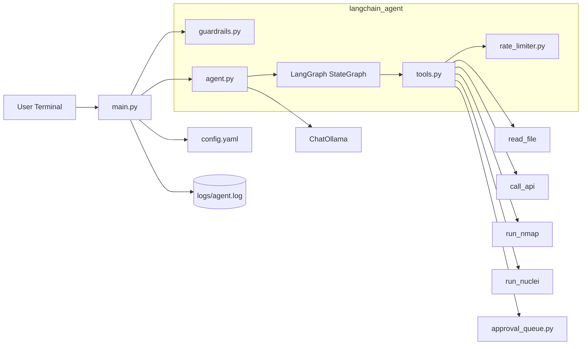
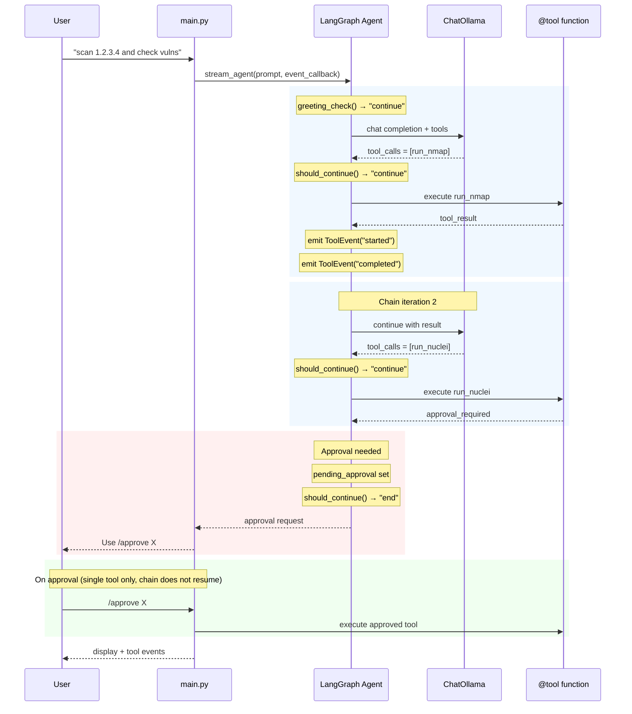

# Architecture

This project uses LangGraph for tool chaining orchestration with Ollama.

## High-Level Topology



## LangGraph Tool Chaining Architecture

```
┌─────────────────────────────────────────────────────────────┐
│                     main.py (CLI Loop)                       │
└─────────────────────┬───────────────────────────────────────┘
                    │
        ┌───────────┴───────────┐
        ▼                   ▼
   guardrails.py     stream_agent()
                          │
                          ▼
               ┌────────────────────┐
               │ LangGraph Agent    │
               ├────────────────────┤
               │ greeting_check()   │──→ decides: greeting or continue
               │ greeting_response()│──→ direct reply for greetings
               │ should_continue() │──→ decides: continue or END
               │ call_llm()         │──→ calls ChatOllama
               │ execute_tool_node()│──→ executes tools + emits events
               └────────────────────┘
                          │
               ┌────────────┴────────────┐
               ▼                         ▼
          Tool Events          Tool Results
          (callback)           (to LLM)
```

## Tool Chaining Flow

```
┌─────────────────────────────────────────────────────────────┐
│  User: "scan server and check for vulns"                    │
└─────────────────────────────────────────────────────────────┘
                          │
                          ▼
              ┌───────────────────────┐
              │  greeting_check()      │
              │  → "continue" (not a  │
              │    greeting)          │
              └───────────────────────┘
                          │
                          ▼
              ┌───────────────────────┐
              │  LLM decides: 2 tools  │
              │  1. run_nmap          │
              │  2. run_nuclei        │
              └───────────────────────┘
                          │
           ┌───────────────┼───────────────┐
           ▼               ▼               ▼
     Tool 1 runs       Error?          Approval?
     + events        ↓↓                   ↓↓
     output ──►   chain stops    chain pauses
     to LLM                       /approve X
     ↓↓                           (single tool
     Tool 2                        only)
     ...
```

## Agent State (TypedDict)

```python
class AgentState(TypedDict):
    messages: list[BaseMessage]      # conversation history
    tool_results: list[str]          # outputs from each tool
    chain_depth: int                 # tools executed so far
    pending_approval: dict | None    # approval state if paused
    retry_count: int                 # reserved (currently unused)
    last_error: str | None          # set on error → terminates chain
```

## Key Components

### ChatOllama
- Connects to local Ollama instance
- Handles chat completions with streaming support

### LangGraph StateGraph
- Tool calling with explicit state management
- Greeting detection bypasses tools for casual input
- Max chain length: 5 tools (enforced)
- Errors terminate the chain (no retry)

### ToolEvent System
```python
class ToolEvent:
    def __init__(self, tool_name: str, event_type: str, message: str = ""):
        self.tool_name = tool_name    # which tool
        self.event_type = event_type  # "started", "completed", "failed"
        self.message = message        # error message if failed (default: "")
        self.timestamp = datetime.now().isoformat()  # set automatically
```

### @tool Decorated Functions
- Auto-generate JSON schemas for prompts
- Return ToolOutput pydantic model

## Request Lifecycle with Tool Chaining



## Module Responsibilities

### main.py
- CLI loop with input/output
- Logging to `logs/agent.log`
- Delegates to LangGraph agent
- Event callback for tool lifecycle display
- `/approve` and `/deny` command handling with live scan output streaming

### langchain_agent/agent.py
- `ChatOllama` initialization
- `create_langgraph_agent()` factory
- `stream_agent(event_callback)` with events
- `invoke_agent()` for blocking calls
- Tool execution state management
- Greeting detection for casual input
- System prompt guides LLM tool selection and parameter names

### langchain_agent/tools.py
- `@tool` decorated functions with detailed descriptions to guide LLM tool selection
- `ToolEvent` class for lifecycle events
- `get_tool_function()` lookup
- `_sanitize_filename()` for safe download filenames from URLs
- nmap/nuclei scans stream output live via `subprocess.Popen` with `stderr=subprocess.STDOUT`
- Empty scan results reported as "No vulnerabilities found"

### langchain_agent/guardrails.py
- `validate_input()`: length + injection detection
- `validate_url()`: scheme check, empty hostname check, DNS resolution + CIDR blocking
- `validate_nmap_target()` / `validate_nuclei_target()`: hostname-boundary matching + DNS resolution + CIDR blocking
- `resolve_host_to_ips()`: DNS resolution with timeout, returns list of IPs
- `is_blocked_ip()`: checks IPs against blocked ranges using `ipaddress` module
- `_is_hostname_blocked()`: shared hostname blocking logic (DNS + string fallback)

### langchain_agent/approval_queue.py
- Approval request management
- `chain_state` stored with request (for future chain resume)

### langchain_agent/rate_limiter.py
- Per-tool rate limiting
- Thread-safe using `threading.Lock()`

### langchain_agent/approval_queue.py
- Approval request management with thread-safe operations
- `chain_state` stored with request (for future chain resume)
- `reset()` method for test cleanup

### langchain_agent/config.py
- Model/host configuration
- Guardrails from config.yaml

## Tool Output Format

All tools return standardized `ToolOutput`:

```python
class ToolOutput(BaseModel):
    status: str             # "success", "error", "blocked", "approval_required"
    tool: str               # tool name
    output: str             # result message
    saved_to: str | None    # file path if saved
```

Tools requiring approval return an `ApprovalRequired` model with a
`request_id` that the user must approve via `/approve <id>`.

## Security

- Input: max 5000 chars, prompt injection detection
- Target validation: DNS resolution (`socket.getaddrinfo`) detects alternate IP representations (hex, octal, decimal, IPv6-mapped)
- Blocked CIDR ranges: `127.0.0.0/8`, `::1/128`, `::ffff:127.0.0.0/104`, `0.0.0.0/32`, `169.254.0.0/16`
- Hostname-boundary matching avoids false positives (e.g., `not-localhost.com` allowed)
- Empty/null hostname in URLs rejected
- nmap/nuclei: target blocking via DNS + CIDR resolution
- nmap: flag allowlist (`-sV`, `-sS`, `-Pn`, `-F`, `-O`)
- call_api: URL scheme + internal targeting blocks + filename sanitization
- Rate limiting: per-tool limits
- Max chain: 5 tools to prevent runaway

## Live Streaming

Tool events stream during execution:

```
[*] Running run_nmap...
[Port scan results...]
[✓] run_nmap completed
[*] Running run_nuclei...
[vuln results...]
[✓] run_nuclei completed
```

Approval flow with live scan output:
```
[*] Running run_nuclei...
[✗] run_nuclei failed: approval required
[approval_required] Use /approve abc123
```

After `/approve`, the scan runs with live output streaming:
```
[+] you -> /approve abc123
[*] Executing run_nuclei (this may take a while)...

                     __     _
   ____  __  _______/ /__  (_)
  / __ \/ / / / ___/ / _ \/ /
 / / / / /_/ / /__/ /  __/ /
/_/ /_/\__,_/\___/_/\___/_/   v3.7.0

[INF] Templates loaded for current scan: 6444
[INF] Targets loaded for current scan: 1
[CVE-2021-44228] http://target/...
Nuclei scan complete. Results saved to: /path/to/file
[Saved to: /path/to/file]
```

Empty results are reported as "No vulnerabilities found" instead of blank output.

## Recent Improvements (2026-04)

- Thread-safe ApprovalQueue and RateLimiter using `threading.Lock()`
- HTTP error handling in `call_api` now properly propagates 4xx/5xx errors
- Nuclei output flushed to disk before reading (fixes race condition)
- Chain depth increments by 1 per execution cycle (not per tool_call)
- Output sanitization removes control characters from tool results
- Enhanced hostname blocking includes `localhost.localdomain`
- `reset()` method added to ApprovalQueue for test cleanup

## Future Extensibility

The architecture supports:
- Adding more tools
- Custom chain termination conditions
- Parallel tool execution (future)
- Conversation memory