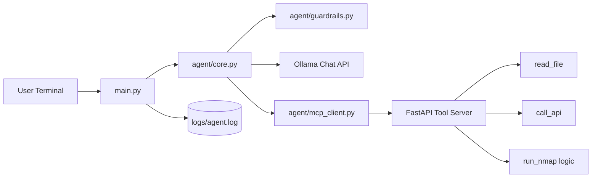
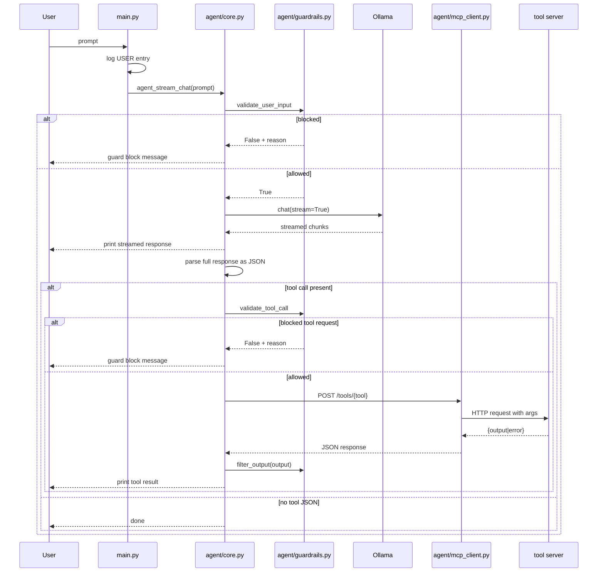
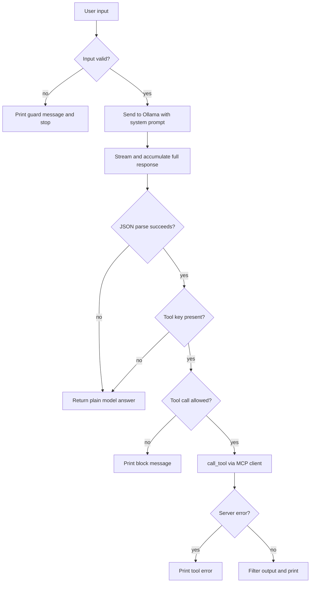
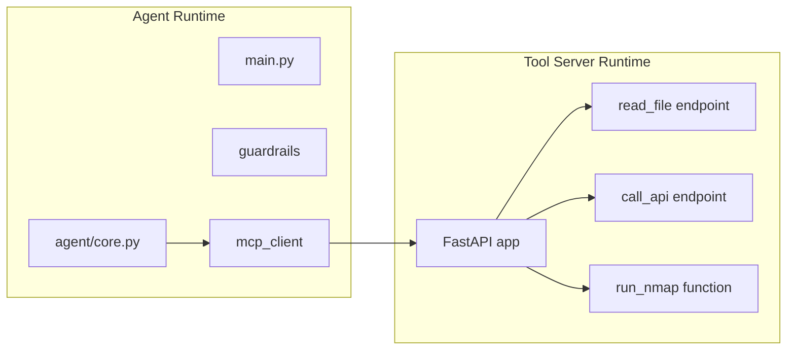

# Architecture

This document describes the current two-process architecture:

- Process 1: CLI Agent (LLM orchestration)
- Process 2: Tool Server (HTTP tool execution)

## High-Level Topology



## Request Lifecycle



## Agent Internal Flow



## Deployment Boundary



## Current Interface Contracts

### LLM to Agent

Expected tool call payload:

```json
{
  "tool": "<tool_name>",
  "args": { "key": "value" }
}
```

### Agent to Tool Server

- `POST /tools/<tool_name>`
- Body: `args` object
- Response: `{ "output": ... }` or `{ "error": ... }`

## Module Map

- `main.py`
  - input loop
  - user logging
  - calls `agent_stream_chat`
- `agent/core.py`
  - guard checks
  - LLM streaming
  - tool JSON parsing and dispatch
- `agent/mcp_client.py`
  - HTTP bridge to MCP server
- `agent/guardrails.py`
  - input policy, tool-call policy, output filtering
- `tool-servers/core_server/server.py`
  - FastAPI tool endpoints and execution logic

## Known Architectural Gaps

1. `run_nmap` route is not currently exposed as `POST /tools/run_nmap`.
2. Option validation error in `run_nmap` references undefined variable `e`.
3. JSON parse path in `agent/core.py` uses broad `except`, masking parsing failures.

