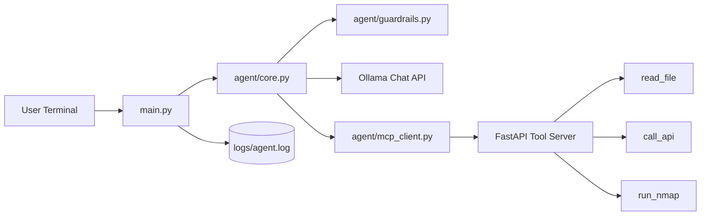
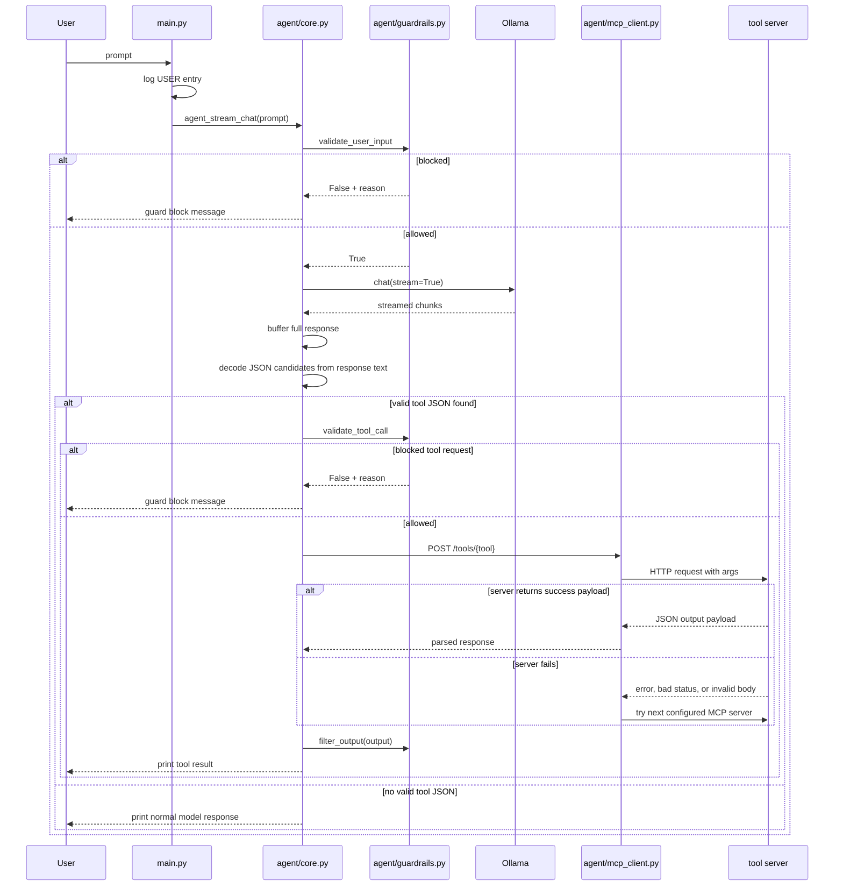
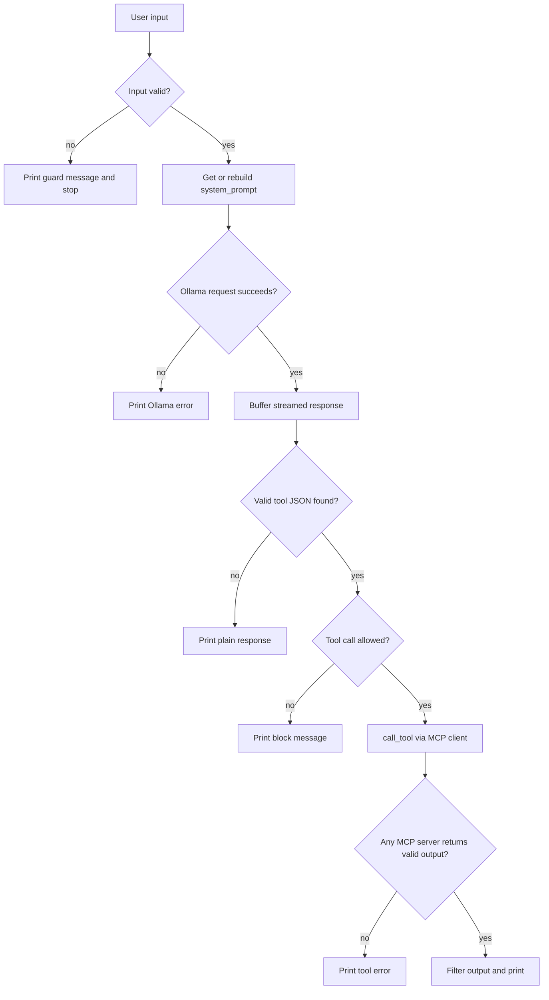
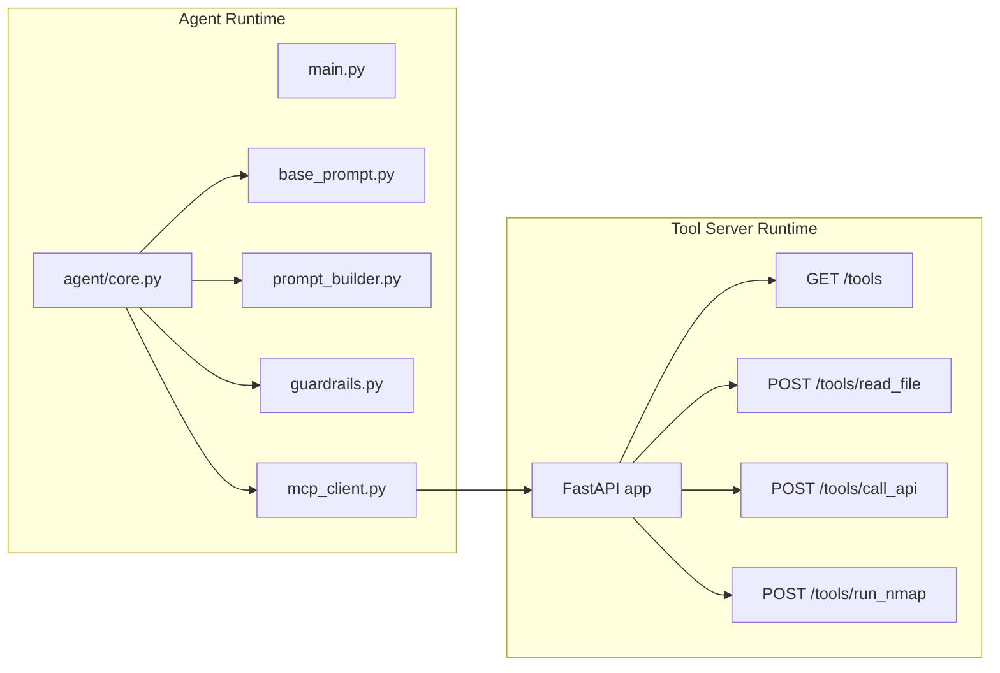

# Architecture

This project runs as a two-process local system:

- Process 1: CLI agent for prompt orchestration and policy checks
- Process 2: FastAPI tool server for external actions

## High-Level Topology



## Prompt Assembly And Refresh

The current implementation builds the system prompt lazily on demand, then reuses it. If discovery returns no tools, the agent can force a refresh and rebuild the prompt.

```mermaid
flowchart TD
    A[agent_stream_chat] --> B[get_system_prompt()]
    B --> C{system_prompt cached?}
    C -- no --> D[discover_tools force_refresh=True]
    C -- yes --> E[discover_tools from cache]
    E --> F{tools empty?}
    F -- yes --> D
    F -- no --> G[reuse cached prompt]
    D --> H[build_tools_section()]
    H --> I[BASE_SYSTEM_PROMPT + YAML tool section]
    I --> J[cache system_prompt]
    J --> K[return prompt]
    G --> K
```

Starting the tool server before the CLI still gives the cleanest startup, but the runtime can now recover from an earlier failed discovery attempt.

## Request Lifecycle



## Agent Internal Flow



## Deployment Boundary



## Module Responsibilities

- `main.py`
  - starts the CLI loop
  - logs user inputs
  - delegates each prompt to `agent_stream_chat`
- `agent/core.py`
  - builds and refreshes the system prompt from discovered tools
  - validates user input
  - calls Ollama with request-level error handling
  - extracts and dispatches tool calls
  - filters and prints tool output
- `agent/base_prompt.py`
  - defines the base tool-usage policy and JSON output rules
- `agent/prompt_builder.py`
  - converts discovered tools into YAML for prompt injection
- `agent/mcp_client.py`
  - discovers tools from one or more MCP servers
  - caches discovered tool metadata
  - executes tool POST requests with retry/failover across configured servers
- `agent/guardrails.py`
  - blocks common prompt-injection phrases
  - blocks selected scan targets
  - filters sensitive phrases from output
- `tool-servers/core_server/server.py`
  - publishes tool metadata
  - implements `read_file`, `call_api`, and `run_nmap`

## Interface Contracts

### Model To Agent

Expected tool payload:

```json
{
  "tool": "<tool_name>",
  "args": {
    "key": "value"
  }
}
```

The active prompt is built from `BASE_SYSTEM_PROMPT` and the discovered tool YAML. `agent/prompt.py` is still present in the repo, but it is not the primary runtime prompt source.

### Agent To Tool Server

- request path: `POST /tools/<tool_name>`
- request body: tool args as JSON
- success response: `{ "output": ... }`
- error response: `{ "error": ... }`

### Tool Discovery Format

`GET /tools` returns:

```json
{
  "tools": [
    {
      "name": "read_file",
      "description": "Read file contents from disk",
      "args": ["file_path"]
    }
  ]
}
```

The client adds a `server` field to each discovered tool entry before caching it. Discovery can also be force-refreshed when the runtime needs to rebuild the prompt.

## Security And Guardrails

- Input filtering blocks known prompt-injection strings.
- `run_nmap` targets are blocked if they include `127.0.0.1`, `localhost`, or `169.254.169.254`.
- `run_nmap` options are restricted server-side to `-sV`, `-sS`, `-Pn`, `-F`, and `-O`.
- Output filtering replaces responses containing selected sensitive phrases.

## Current Limitations

1. Tool discovery is cached for the lifetime of the process, so prompt-visible tool changes require an agent restart.
2. The Ollama response is buffered completely before any user-visible output is printed, even though streaming is enabled upstream.
3. Logging currently captures user inputs only.
4. `call_api` performs a raw GET and returns the response body as text without additional policy or shaping.
5. `agent/prompt.py` remains as an older prompt definition and may confuse future maintenance unless it is removed or clearly deprecated.
