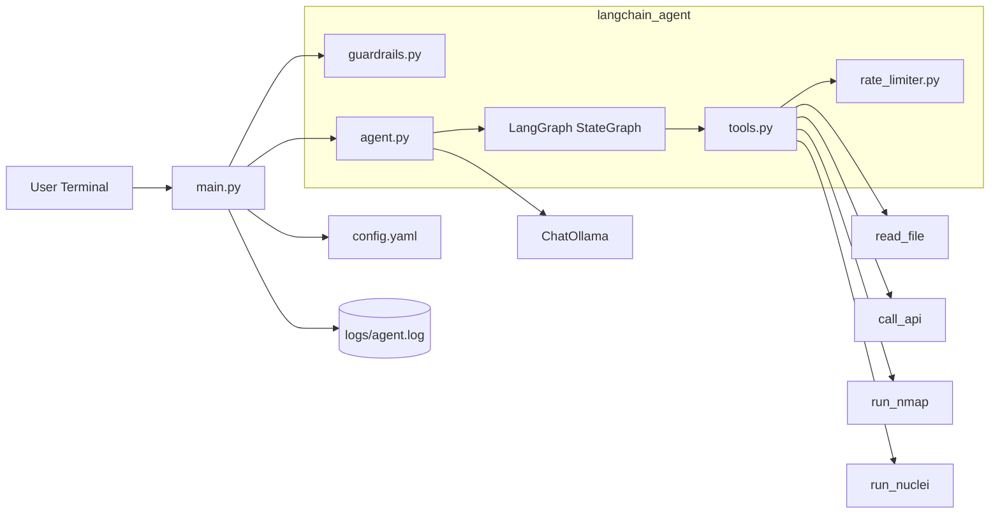
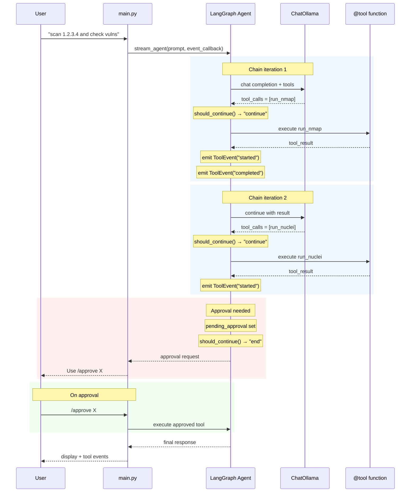

# Architecture

This project uses LangGraph for tool chaining orchestration with Ollama.

## High-Level Topology



## LangGraph Tool Chaining Architecture

```
┌─────────────────────────────────────────────────────────────┐
│                     main.py (CLI Loop)                       │
└─────────────────────┬───────────────────────────────────────┘
                    │
        ┌───────────┴───────────┐
        ▼                   ▼
   guardrails.py     stream_agent()
                         │
                         ▼
              ┌────────────────────┐
              │ LangGraph Agent    │
              ├────────────────────┤
              │ should_continue() │──→ decides: continue/end
              │ call_llm()         │──→ calls ChatOllama
              │ execute_tool_node() │──→ executes tools + emits events
              └────────────────────┘
                         │
              ┌────────────┴────────────┐
              ▼                         ▼
         Tool Events          Tool Results
         (callback)           (to LLM)
```

## Tool Chaining Flow

```
┌─────────────────────────────────────────────────────────────┐
│  User: "scan server and check for vulns"               │
└─────────────────────────────────────────────────────────────┘
                          │
                          ▼
              ┌───────────────────────┐
              │  LLM decides: 2 tools  │
              │  1. run_nmap          │
              │  2. run_nuclei        │
              └───────────────────────┘
                          │
          ┌───────────────┼───────────────┐
          ▼               ▼               ▼
    Tool 1 runs       Error?          Approval?
    + events        ↓↓                   ↓↓
    output ──►   LLM decides    Pause until
    to LLM       alternate      /approve X
    ↓↓          or stop
    Tool 2
    ...
```

## Agent State (TypedDict)

```python
class AgentState(TypedDict):
    messages: list[BaseMessage]      # conversation history
    tool_results: list[str]        # outputs from each tool
    chain_depth: int             # tools executed so far
    pending_approval: dict | None  # approval state if paused
    retry_count: int            # error recovery attempts
    last_error: str | None     # last error for fallback
```

## Key Components

### ChatOllama
- Connects to local Ollama instance
- Handles chat completions with streaming support

### LangGraph StateGraph
- Tool calling with explicit state management
- Supports: think → act → observe → repeat loop
- Max chain length: 5 tools (enforced)
- Error recovery: 1 retry per tool with fallback

### ToolEvent System
```python
class ToolEvent:
    tool_name: str      # which tool
    event_type: str    # "started", "completed", "failed"
    message: str     # error message if failed
    timestamp: str   # ISO timestamp
```

### @tool Decorated Functions
- Auto-generate JSON schemas for prompts
- Return ToolOutput pydantic model

## Request Lifecycle with Tool Chaining



## Module Responsibilities

### main.py
- CLI loop with input/output
- Logging to `logs/agent.log`
- Delegates to LangGraph agent
- Event callback for tool lifecycle display

### langchain_agent/agent.py
- `ChatOllama` initialization
- `create_langgraph_agent()` factory
- `stream_agent(event_callback)` with events
- `invoke_agent()` for blocking calls
- Tool execution state management
- Error recovery logic

### langchain_agent/tools.py
- `@tool` decorated functions
- `ToolEvent` class for lifecycle events
- `set_tool_event_callback()` registration
- `get_tool_function()` lookup

### langchain_agent/guardrails.py
- `validate_input()`: length + injection detection
- Target blocking (localhost, metadata IPs)

### langchain_agent/approval_queue.py
- Approval request management
- `chain_state` for resume after approval

### langchain_agent/rate_limiter.py
- Per-tool rate limiting

### langchain_agent/config.py
- Model/host configuration
- Guardrails from config.yaml

## Tool Output Format

All tools return standardized `ToolOutput`:

```python
class ToolOutput(BaseModel):
    status: str        # "success", "error", "blocked"
    tool: str          # tool name
    output: str      # result message
    saved_to: str | None  # file path if saved
```

## Security

- Input: max 5000 chars, prompt injection detection
- nmap/nuclei: target blocking via config
- nmap: flag allowlist
- call_api: URL scheme + internal targeting blocks
- Rate limiting: per-tool limits
- Max chain: 5 tools to prevent runaway

## Live Streaming

Tool events stream during execution:

```
[*] Running run_nmap...
[Port scan results...]
[✓] run_nmap completed
[*] Running run_nuclei...
[vuln results...]
[✓] run_nuclei completed
```

Approval pauses execution:
```
[*] Running run_nmap...
[✓] run_nmap completed
[approval_required] Use /approve abc123
```

## Future Extensibility

The architecture supports:
- Adding more tools
- Custom chain termination conditions
- Parallel tool execution (future)
- Conversation memory