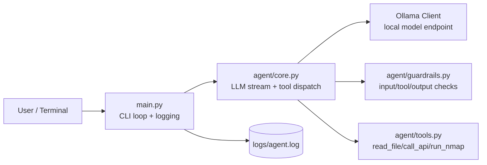
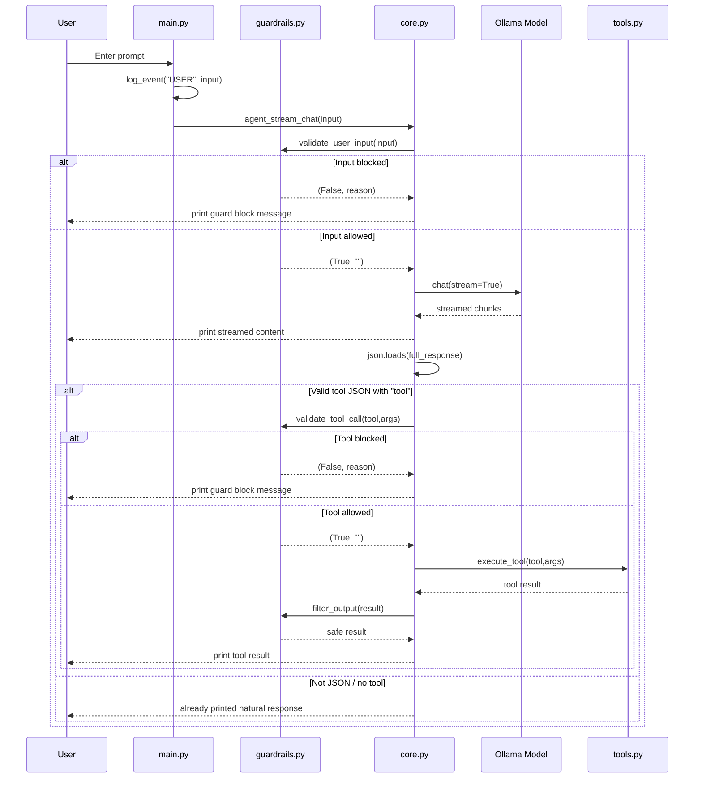
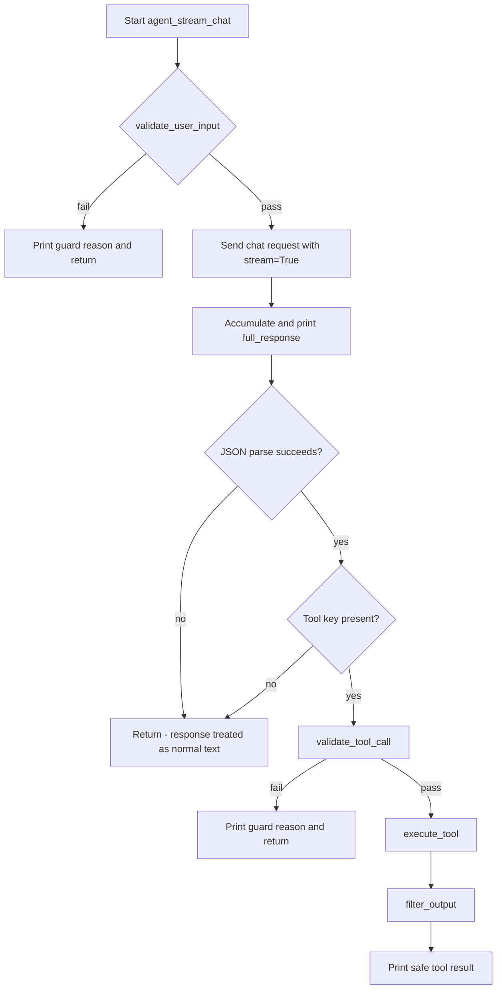
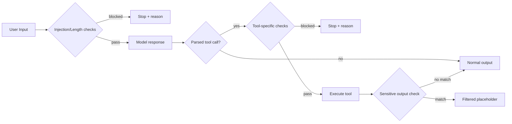

# Architecture

This document is a concise, engineering-focused reference for how the agent is structured and how requests flow through the system.

## System Components

## End-to-End Request Flow

## Core Decision Logic

## Guardrail Pipeline

## Module Map

- `main.py`
  - CLI loop
  - user input logging
  - invokes `agent_stream_chat`
- `agent/core.py`
  - LLM request and stream handling
  - tool-call JSON parsing
  - tool dispatch and output filtering
- `agent/guardrails.py`
  - `validate_user_input`
  - `validate_tool_call`
  - `filter_output`
- `agent/tools.py`
  - `read_file`
  - `call_api`
  - `run_nmap`
- `agent/prompt.py`
  - system behavior and tool-calling instruction prompt
- `agent/config.py`
  - model/host/name/log configuration

## Known Architectural Constraints

- Tool invocation depends on full-response JSON parse success.
- No multi-turn context persistence in `messages`.
- User prompts are logged; assistant/tool metadata is not yet logged.
- Prompt and code allowed options for `run_nmap` are slightly misaligned.
