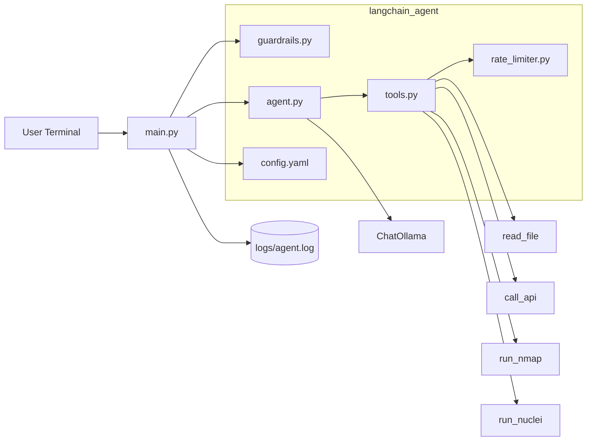
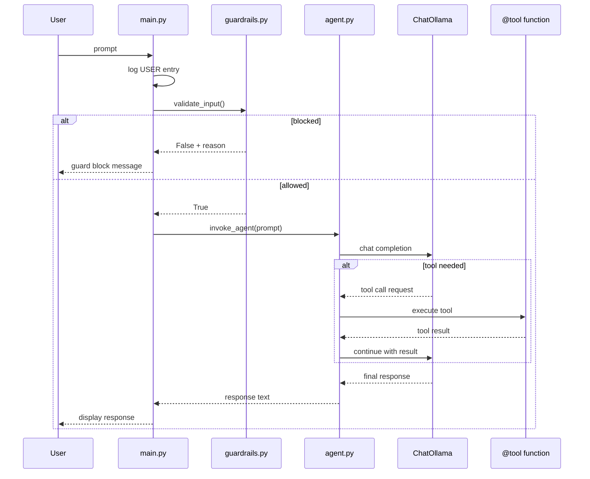

# Architecture

This project uses LangChain's ReAct (Reason + Act) agent pattern with Ollama for tool-calling orchestration.

## High-Level Topology



## Single-Process Architecture

The system runs in a single Python process:

```
┌─────────────────────────────────────────────────────────────┐
│                     main.py (CLI Loop)                       │
└─────────────────────┬───────────────────────────────────────┘
                      │
          ┌───────────┴───────────┐
          │                       │
          ▼                       ▼
   guardrails.py           langchain_agent/
                                  │
                     ┌────────────┼────────────┐
                     │            │            │
                     ▼            ▼            ▼
                 config.py   tools.py      agent.py
                              │            │
                              ▼            ▼
                           [tools]    ChatOllama
                                       + ReAct Agent
```

## LangChain Components

### ChatOllama
- Connects to local Ollama instance
- Handles chat completions with streaming support

### create_react_agent
- LangGraph's pre-built ReAct agent
- Handles: think → act → observe → repeat loop
- Built-in tool calling with structured output

### @tool Decorated Functions
- Auto-generate JSON schemas for prompts
- Direct Python execution (no HTTP overhead)

## Request Lifecycle



## Module Responsibilities

### main.py
- CLI loop with input/output
- Logging to `logs/agent.log`
- Delegates to LangChain agent

### langchain_agent/agent.py
- `ChatOllama` initialization
- `create_react_agent` setup
- `invoke_agent()` function
- Error handling for Ollama connection

### langchain_agent/tools.py
- `@tool` decorated functions
- `read_file`: file system access (sandbox-constrained)
- `call_api`: HTTP GET requests (URL validation)
- `run_nmap`: network scanning
- `run_nuclei`: vulnerability scanning

### langchain_agent/guardrails.py
- `validate_input()`: length + injection detection
- `validate_nmap_target()` / `validate_nuclei_target()`: blocks localhost/127.0.0.1/metadata IP
- `validate_url()`: blocks unsafe URL schemes and internal targets

### langchain_agent/rate_limiter.py
- Per-tool rate limiting (configurable per-minute limits)

### langchain_agent/approval_queue.py
- Approval request management (pending, approved, denied, expired)
- Auto-approve workflow

### langchain_agent/config.py
- `MODEL_NAME`: Ollama model (default: "llama3.1")
- `OLLAMA_HOST`: Ollama API URL
- `AGENT_NAME`: display name
- `LOG_FILE`: log file path
- Guardrails configuration (from config.yaml)

## Tool Schemas

LangChain auto-generates JSON schemas from `@tool` decorators:

```python
@tool
def run_nmap(target: str, options: str = "-sV") -> str:
    """Run network scan..."""
    ...

# Generates:
{
  "name": "run_nmap",
  "description": "Run network scan...",
  "parameters": {
    "type": "object",
    "properties": {
      "target": {"type": "string"},
      "options": {"type": "string", "default": "-sV"}
    },
    "required": ["target"]
  }
}
```

## Security

- Input: max 5000 chars (configurable), prompt injection detection
- Tools: nmap/nuclei target blocking (localhost, 127.0.0.1, 169.254.169.254) - configurable via config.yaml
- Tools: nmap flag allowlist (`-sV`, `-sS`, `-Pn`, `-F`, `-O`) - configurable via config.yaml
- call_api: URL scheme validation (only http/https), blocks internal targets
- Rate limiting: configurable per-tool, per-minute limits

## Tool Output Format

All tools return standardized `ToolOutput` pydantic model:

```python
class ToolOutput(BaseModel):
    status: str       # "success", "error", "blocked"
    tool: str         # tool name
    output: str      # result message
    saved_to: str | None  # file path if saved
```

## Future Extensibility

The architecture supports:
- Adding more tools (add `@tool` decorated function)
- Conversation memory (add `ChatMessageHistory`)
- RAG capabilities (add vector store integration)
